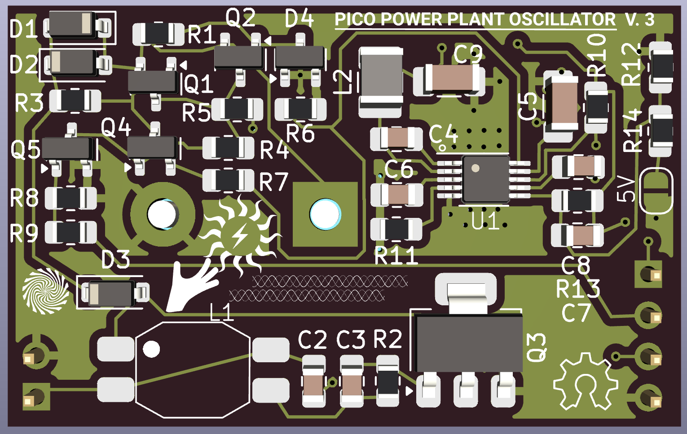
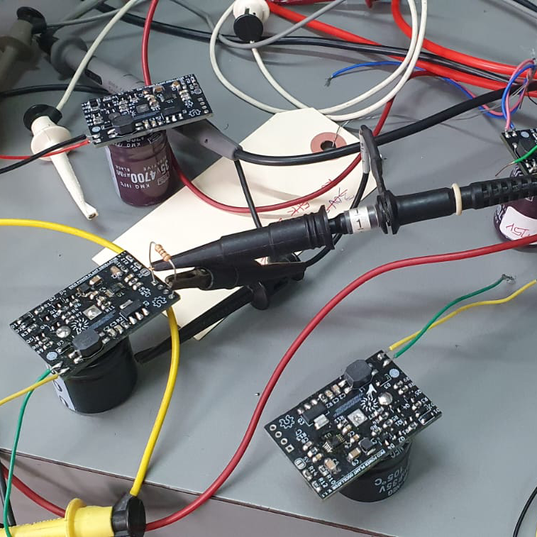
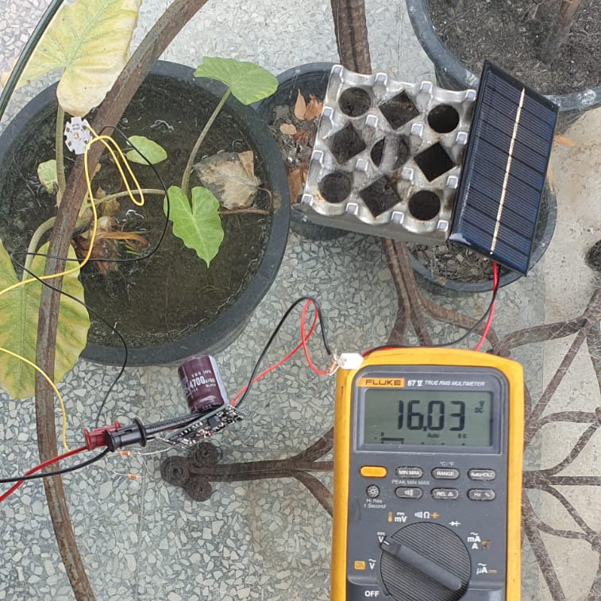
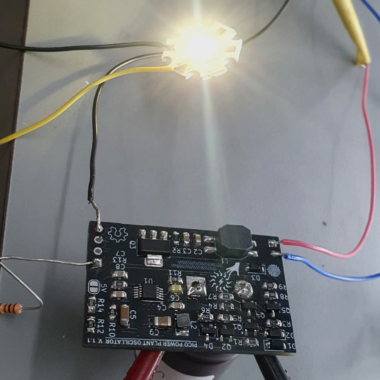
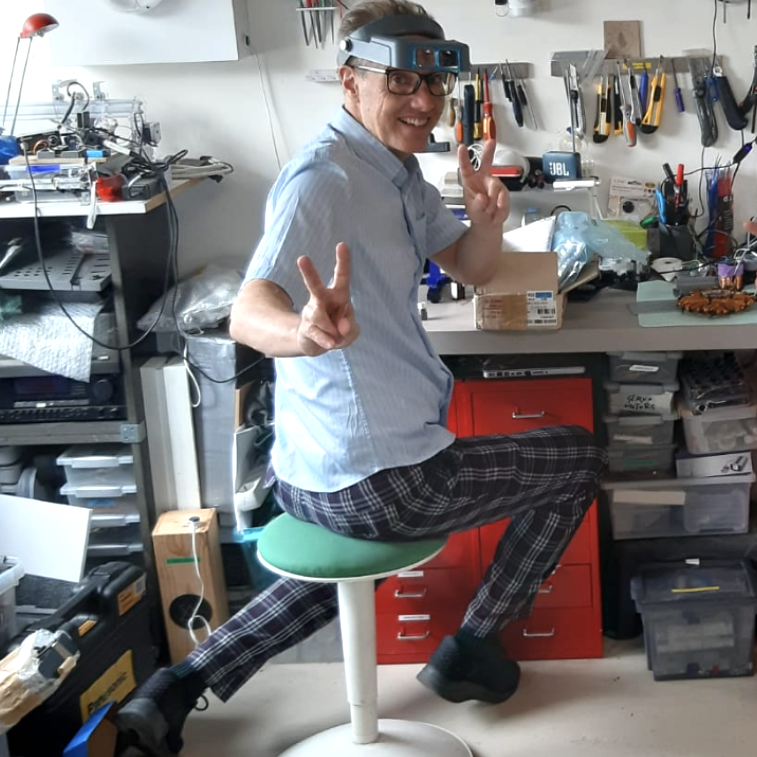
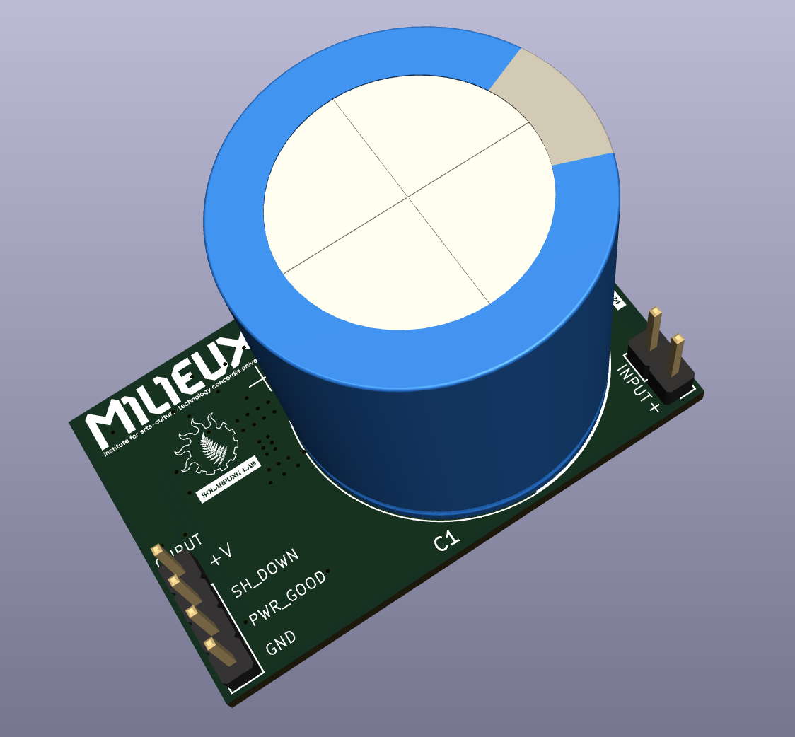
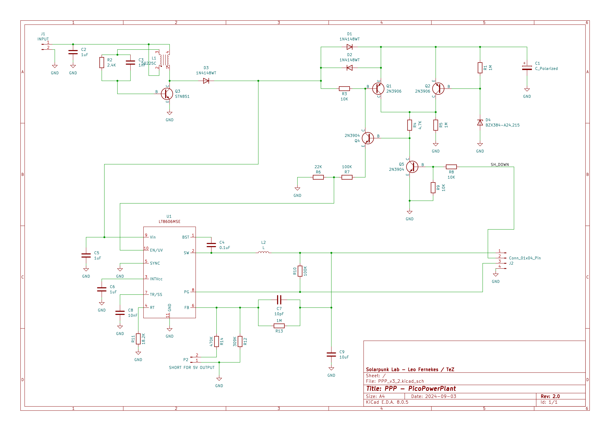

## SOLAR THIEF 
aka Pico Power Plant Oscillator

<!-- PROJECT LOGO -->

 

 

 

<!-- TABLE OF CONTENTS -->

  
CONTENTS

  <ul>
    <li><a href="#about">In a nutshell</a></li>
    <li><a href="#description">Description</a>
    <li><a href="#functional">Functional trigger resolution</a>
     <li><a href="#compromises">Compromises</a>  
     <li><a href="#operation">Theory of operation</a>  
      <li><a href="#pcb">PCB, Gerber and BOM</a> 
     <li><a href="#credits">Credits</a>     
   
   	 
  </ul>

## Solar Thief in a nutshell

<ul>
<li> Harvests energy from small solar panels using a simple joule thief boost converter.
<li> Stores energy in common low-cost electrolytic capacitors.
<li> Provides 5V DC power for short intervals.
<li> Harvests in low light conditions
<li> Provides energy in bursts, the interval between bursts is determined by the solar intensity
<li> Powers small remote sensors indefinitely.

</ul>
  

  

<table width=100% bordercolor=#000>
<tr>
<td width=50% align="center">

<td width=50% align="center">

</tr>
<tr>
<td width=50% align="center">

<td width=50% align="center">

</tr>

</table>

<!-------  BACK   --------->

[ <a href="#readme-top"> back</a> ]

## Solar Thief Energy Harvester

This innovative device utilizes a clever joule thief boost converter to efficiently harvest energy, even from the smallest of panels. It stores the collected power in low-cost electrolytic capacitors, making it an economical choice.
 
In need of reliable 5V DC power? The Solar Thief has you covered, delivering power in short, consistent intervals. Whether it's a sunny day or overcast, this harvester performs admirably, even in low light conditions. It adapts to the solar intensity, providing energy bursts that ensure your devices stay powered when they need it most.
 
Perfect for powering small remote sensors, the Solar Thief Energy Harvester offers a sustainable, off-grid solution. With this device, you can keep your sensors running indefinitely, making it an ideal choice for remote monitoring and off-grid applications.
<!-------  BACK   --------->

[ <a href="#readme-top"> back</a> ]

## Functional trigger resolution

<ul>
<li> Input voltage is clamped to 24 V (dissipative clamp is fine)
<li> Triggers when Vcap rises over ~ 24V
<li> Resets when Vcap goes below 5V
<li> Has super low leakage
<li> Reset input overrides and resets to idle.
</ul>
  
<!-------  BACK   --------->

[ <a href="#readme-top"> back</a> ]

## Compromises

All electrolytic capacitors have leakage, this leakage is proportional to the applied voltage and total capacitance, it also increases with temperature.
 
Our Joule-thief circuit acts as an energy pump, supplying fixed chunks of energy in every cycle, 
while boosting the voltage at the same time. What this means is that when the storage capacitor is at a low voltage, the current output of the converter is relatively high, as the capacitor voltage rises, the current decreases, maintaining a constant current x voltage product. The capacitor charges rapidly at the start, but begins slowing as the voltage increases.
Since the energy stored in the capacitor is = ½ CV2, the amount of energy we can store is increased substantially by allowing the capacitor to reach higher charge voltages.
 
The compromise is therefore the balance of charging current to leakage current.
When the charging current and leakage current become equal, the capacitor voltage no longer rises, and the circuit remains “stuck’ in this state if this equilibrium voltage is lower than the trigger circuit threshold.
It’s tempting to add more capacitance to increase the circuits run-time, but this does have the effect of increasing the amount of input power required for cycling.
 
The optimal solution is to size the storage capacitor to the load being driven, keeping the capacitor as small as possible to minimize the parasitic leakage.

<!-------  BACK   --------->

[ <a href="#readme-top"> back</a> ]

## Theory of operation

 

Q3 and common-mode choke LI form a classical joule thief circuit, with two coil windings on the same core. This circuit can operate from as little as 0.6 volts.
When power is applied, current flow through R1 into the base of the transistor starts collector current flowing, this current induces an aiding voltage in the winding connected to the base, which in turn supplies even more base current. This regenerative action continues until the core is fully magnetized and cannot support additional current, when this occurs, the magnetic field begins to collapse, which induces a voltage pulse at Q3’s collector, rising as the transistor stops conducting.
The base-connected winding now reverses polarity, shutting the transistor off even faster, this action continues until the transistor is totally cut off. 
The voltage on the collector rises until a path for L1’s energy develops, which is through D3 and D1 to the storage capacitor, L1 transfers most of it’s energy to the capacitor and the cycle repeats.
The storage capacitor now charges slowly until the trigger circuit fires, turning on the output regulator.
Transistors Q1, Q2 and Q4 form the voltage sensing trigger switch. 
The Zener diode D4 begins to conduct once the storage capacitor nears 24 volts, Q2 amplifies this Zener current and feeds a signal to the latch-connected pair Q1 and Q4. These transistors are connected in a way that causes them to latch into a conductive state when either one begins conducting- any current through Q4 causes Q1 to conduct- which feeds back to Q1 - until they are both locked in conduction.
  

  

The conduction of Q4 raises the voltage on the emitter, which feeds the voltage divider formed by R6 and R7, the resulting voltage is fed to the ENABLE pin of the LT8606 switching regulator, which has been dormant, consuming almost zero current, the rising voltage turns on the regulator, which is powered by the main storage capacitor via D2. The regulator now outputs a fixed, regulated voltage of either 5 or 3.3 volts, depending on the setting of the jumper P2, which adjusts the ratio of feedback resistance in the regulators feedback loop, consisting of C7, R13 and R14+R12. 
Note that power from the joule thief can also continue to flow and assist in powering the circuit via D3.
The additional transistor Q5 allows an external signal to shut down the and reset the system by forcing Q4’s base to ground, which shuts off both the regulator and Q1.
  
When the capacitor voltage drops near the minimum voltage to keep the regulator working, the voltage on the ENABLE drops below the threshold, shutting down the regulator.
With the load removed, all charging current flows through D1 which causes a reverse bias of Q1, ensuring that the pair Q1-Q4 unlatch and cease conduction.
  
And the cycle repeats -
  

[ <a href="#readme-top"> back</a> ]

## PCB / Gerber & BOM
<a href="board/">
</a>

<a href="board/">KiCad project</a>
<!-------  BACK   --------->

[ <a href="#readme-top"> back</a> ]

## Credits

This project was possible thanks to the wisdom and genius of master <a href="https://www.youtube.com/@leosbagoftricks3732">Leo Fernekes </a> and the generous moral and financial support of  <a href ="https://milieux.concordia.ca">MILIEUX</a> / Concordia University (Montreal).
  
Circuit design: Leo Fernekes
 
PCB / KiCad design: TeZ
<!-------  BACK   --------->

[ <a href="#readme-top"> back</a> ]

## CONTACT

<a href="mailto:tez@solarpunklab.org">tez@solarpunklab.org
<!-------  BACK   --------->

[ <a href="#readme-top"> back</a> ]

